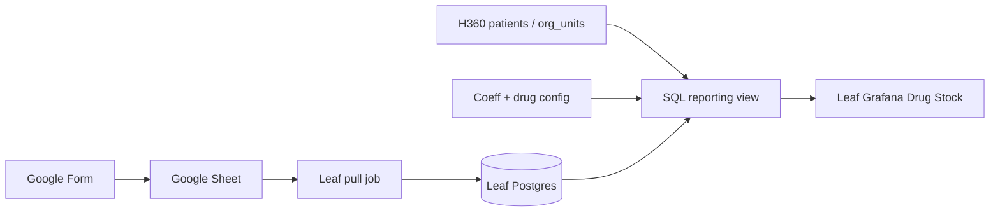
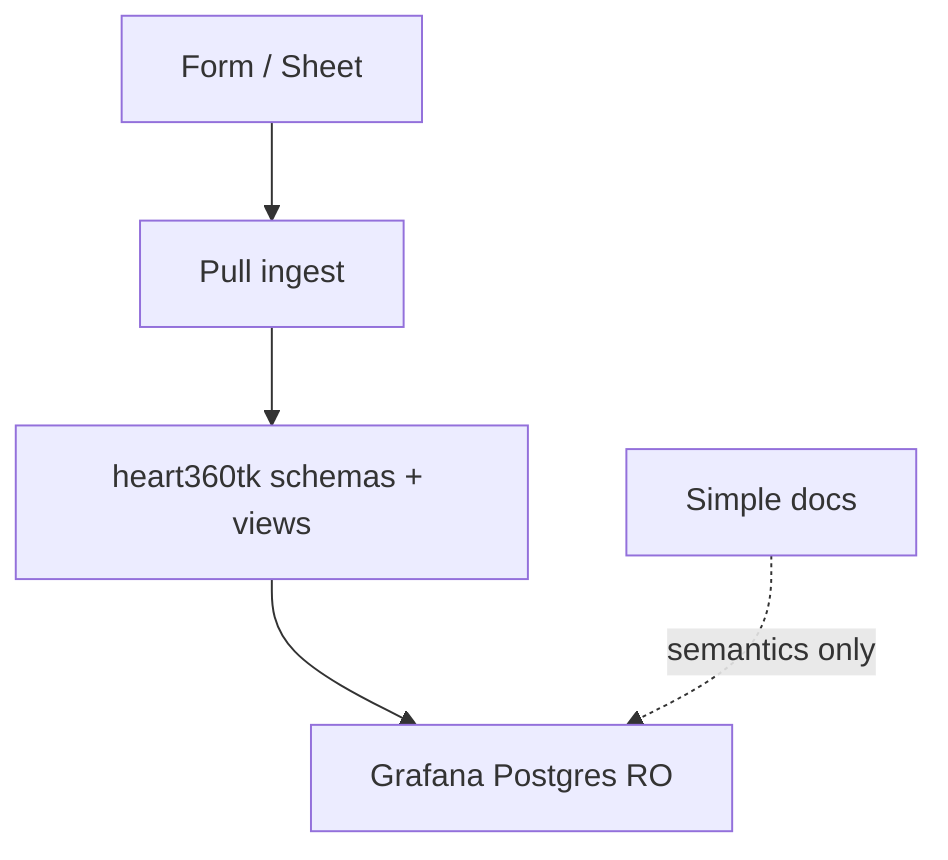
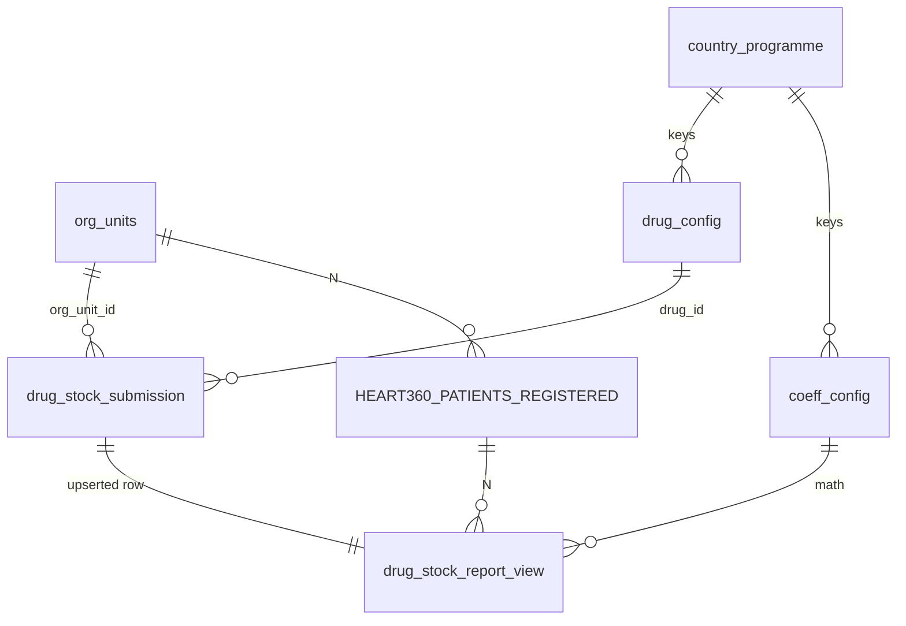

# Architecture Spine — HEARTS360 leaf Drug Stock MVP

## Design Paradigm

**Pipes-and-filters.** Each stage owns one job; stages do not leapfrog.

| Stage | Owns | Must not |
| --- | --- | --- |
| Google Form | Capture In-Stock (+ facility key, month, drug) | Patients, coeffs, Patient-Days, Grafana UI |
| Google Sheet | Transport / response landing | Be Grafana system of record |
| Leaf pull ingest | Validate + upsert into Postgres | Serve dashboards; call Simple |
| Leaf Postgres | Store of record + config + reporting view | Be written by Grafana dashboard user |
| Leaf Grafana | Read view; tree + month; Simple **report** semantics | Entry forms; Sheets datasource as SoT; Business Forms entry |
| Simple Dashboard | Meaning reference (docs only) | Runtime dependency |



## Invariants & Rules



### AD-1 — Leaf-only MVP boundary [ADOPTED]

- **Binds:** all Drug Stock MVP; FR-4–FR-14
- **Prevents:** Building Simple/central/demo-only forks of the same report for v1; adding Simple `received`/consumption metrics
- **Rule:** Ship Drug Stock only on **leaf H360**. No runtime integration with Simple. No `received`, consumption, or central aggregation in MVP. **Community-facility product policy** (in-app filters) is deferred; prototype **Form facility list** still excludes community-size sites per FR-3 (ops list curation, not a second dashboard mode).

### AD-2 — Product code lives in `h360tk_grafana_core` [ADOPTED]

- **Binds:** schema, views, pull job, dashboard JSON, seeded config, tree plugin enablement
- **Prevents:** Feature stranded in `h360tk_demo` or duplicated per vendor leaf
- **Rule:** Tables, migrations, ingest job, coeff/drug seeds, Drug Stock dashboard JSON, and tree-panel enablement for this feature land in **`h360tk_grafana_core`**. `h360tk_demo` may supply deploy env (Sheet ID, SA credentials, active programme key) only.

### AD-3 — Postgres is store of record; Sheet is capture pipe [ADOPTED]

- **Binds:** FR-13; FR-1–FR-3
- **Prevents:** Grafana Google Sheets datasource as production SoT; joining patients to a live Sheet
- **Rule:** Accepted submissions exist in leaf Postgres after ingest. Grafana Drug Stock reads **Postgres only**. Sheet may be edited and re-pulled; it is never the dashboard SoT.

### AD-4 — Leaf pulls Sheet; no push write API for MVP [ADOPTED]

- **Binds:** ingest path; FR-13
- **Prevents:** Public/on-prem leaf write endpoint called from Apps Script; second ingest style beside leaf jobs
- **Rule:** A **scheduled job in core** pulls Sheet rows (Sheets API + service account), validates, and **upserts** into Postgres. No Apps Script → leaf HTTP push in MVP. Dashboard Grafana datasource role stays **read-only** for Drug Stock panels (writes only via ingest / existing admin refresh paths, not Drug Stock entry).

### AD-5 — Latest Wins physical upsert [ADOPTED]

- **Binds:** FR-2
- **Prevents:** Duplicate facility+month+drug rows; append-only history that diverges from upsert semantics
- **Rule:** Natural key is exactly `(org_unit_id INTEGER FK → org_units.id, reporting_month DATE = first day of month, drug_id FK → drug_config)`. Implement Latest Wins as **physical UPSERT/REPLACE** on that key — not append + `ROW_NUMBER` for MVP. Persist `submitted_at` (or pull timestamp) on the row for ops; full audit history table is deferred. Blank ≠ zero per AD-12.

### AD-6 — Facility identity is `org_units.id` [ADOPTED]

- **Binds:** FR-1, FR-3, FR-14; ingest join
- **Prevents:** Name-only matching; silent drop of bad rows into the report
- **Rule:** Form **submits** `org_units.id` (names display-only). Ingest **rejects** rows that do not resolve to that id (log/quarantine outside the reporting view — they must not appear as Stock). Form facility list synced to that leaf’s org tree and **excludes community-size facilities** for the prototype cohort (FR-3).

### AD-7 — Country-keyed coeff and drug config; single activation [ADOPTED]

- **Binds:** FR-11, FR-12, FR-9
- **Prevents:** Coeffs/drugs in panel JSON or admin Sheet; pull and view using different active programmes
- **Rule:** Coefficients and stock-tracked drugs live in Postgres config tables keyed by country/programme. MVP: RTSL seeds India/IHCI (exact protocol row set — e.g. AATTCC vs ATTACC — chosen at seed time; see Deferred). **One** deploy setting selects the active programme; **both** the pull job (which drug rows to accept) and the reporting view (which coeffs apply) **must read that same setting**. No second activation path. Country self-serve UI deferred.

### AD-8 — Patients N from registered reporting table [ADOPTED]

- **Binds:** FR-10; SM-3
- **Prevents:** Under-care N; Sheet-entered N; divergent registered SQL per implementer
- **Rule:** Denominator N comes from **`heart360tk_reporting.HEART360_PATIENTS_REGISTERED`** (or successor of same grain), joined on `org_unit_id`. Never under-care. Never Form-entered. Story acceptance must verify the exact SQL grain against programme before Patient-Days is called done (registered ≠ under-care; ~LTFU gap is accepted programme choice, not a bug to “fix” with under-care).

### AD-9 — Patient-Days computed in one SQL view [ADOPTED]

- **Binds:** FR-9–FR-11; SM-3
- **Prevents:** Divergent panel formulas; Grafana write-side calc
- **Rule:** One reporting view joins Latest Wins stock ⨝ registered patients ⨝ active coeffs, including dose normalization and **Load Factor default 1.0** unless config supplies another. Panels **read** that contract only.

### AD-10 — New dashboard; tree-only org nav [ADOPTED]

- **Binds:** FR-4–FR-7, FR-14; UX DESIGN/EXPERIENCE
- **Prevents:** Mutating baseline HTN dashboards; substituting cascades for tree; inventing alternate threshold bands
- **Rule:** Ship a **new** Drug Stock dashboard JSON (own UID + nav link). Org filter = Change Location **tree** (`equansdatahub-tree-panel` → `org_unit` / `get_descendant_ids`); empty = nationwide. **Enable/install the tree plugin in core as part of this feature** (pattern may come from `tony_treepanel` / showcase — it is not assumed already on default main). No cascading `ou_1…ou_7` in MVP. Presentation bands, category order, month vs time-picker, `?`/`—`/`0` mappings, and accessibility floor are **governed by UX DESIGN/EXPERIENCE** — implementers must not invent alternate bands or chrome.

### AD-11 — Dependency direction [ADOPTED]

- **Binds:** all
- **Prevents:** Grafana → Sheet; Simple → leaf API; dashboard → write path
- **Rule:** Allowed edges only: Form→Sheet→Pull→Postgres→View→Grafana. Config and patients feed the view inside Postgres. Simple docs may inform UX copy; they must not be a runtime call.

### AD-12 — In-Stock tri-state in storage [ADOPTED]

- **Binds:** FR-6
- **Prevents:** Blank coerced to `0`; SQL NULL collapse that makes unknown look like zero
- **Rule:** `in_stock` is **nullable numeric**. `NULL` = unknown/blank; `0` = zero stock; positive = count. Ingest must not coerce blank/`?` to `0`. Grafana value maps express `?` / `—` / `0` on top of that storage contract.

## Consistency Conventions

| Concern | Convention |
| --- | --- |
| Schemas | Prefer existing `heart360tk_schema` / `heart360tk_reporting`; do not invent a parallel “grafana_core” schema name |
| Naming | Tables/views: `drug_stock_*`; config keyed by country/programme; dashboard UID consistent with core |
| Natural key | `(org_unit_id, reporting_month DATE yyyy-mm-01, drug_id)` only |
| Sheet columns (MVP contract) | At least: `org_unit_id`, `reporting_month`, `drug_code` (maps to `drug_config`), `in_stock`, optional `submitted_at` |
| Facility key | `org_units.id` on the wire; names display-only |
| Reporting month | First-of-month `DATE`; dashboard variable `reporting_month` **separate** from Grafana time picker |
| In-Stock values | AD-12 storage + UX value maps |
| Mutations | Pull ingest upsert + DBA/SQL config seeds only for Drug Stock writes |
| Active programme | Single deploy setting shared by pull + view (AD-7) |
| Secrets | Sheet ID + Google SA in leaf deploy secrets; never in this knowledge repo or dashboard JSON |
| Corrections | Edit Sheet / resubmit Form → next pull UPSERTs |
| UX presentation | Thresholds (&lt;30/&lt;60/&lt;90), category order, table chrome → UX docs, not re-specified here |
| Out of scope metrics | No Simple `received` or consumption in v1 |

## Stack

| Name | Version |
| --- | --- |
| Leaf product repo | `h360tk_grafana_core` (brownfield) |
| PostgreSQL | 16-alpine (core `heart360.pg_database.docker`) |
| Python (ingest/exporter-style images) | 3.12-slim |
| Grafana base image | `grafana/grafana:latest` (floating in core today — pin when Drug Stock ships if release requires) |
| Tree panel | `equansdatahub-tree-panel` (enable in core with this feature; not on default main today) |
| Google Form + Sheet | Workspace (host open — see Deferred) |
| Google Sheets API | v4 read via service account (scheduled pull) |

## Structural Seed

```text
h360tk_grafana_core/
  pg_init_scripts/ and/or migrations/   # drug_stock_* + config + view (migrations not auto-run on init — follow core practice)
  <pull-job>/                           # scheduled Sheet → Postgres upsert (path owned by implementers within AD-4)
  docker_build/                         # enable tree plugin if not already in grafana image
  grafana_provisioning/dashboards/      # NEW Drug Stock dashboard JSON only
```



**Deploy envelope (MVP):** Leaf compose runs pull on a schedule **or** ops-triggered run (cadence chosen in stories; monthly is enough). Requires egress to Google Sheets API and SA access to the programme Sheet. Form/Sheet hosting (RTSL vs ministry) is ops. Failed pulls must not corrupt existing Latest Wins rows (fail closed; leave prior upserts).

## Capability → Architecture Map

| Capability | Lives in | Governed by |
| --- | --- | --- |
| FR-1 Submit In-Stock | Form → Sheet → pull upsert | AD-3, AD-4, AD-6, AD-12 |
| FR-2 Latest Wins | Physical upsert natural key | AD-5 |
| FR-3 Facility scope | Form org list + `org_units.id` | AD-1, AD-6 |
| FR-13 Toolkit SoR | Postgres submissions | AD-3, AD-4 |
| FR-4–FR-7, FR-14 Dashboard + month + tree | New Grafana JSON + view | AD-9, AD-10 |
| FR-5–FR-6 Report semantics | Panels / value maps + storage | AD-10, AD-12; UX docs |
| FR-9–FR-11 Patient-Days + coeffs | SQL view + coeff_config | AD-7, AD-8, AD-9 |
| FR-12 Protocol drug set | drug_config + Form list | AD-7 |
| FR-8 CSV | — | Deferred |

## Deferred

- Central / national Drug Stock aggregation.
- Country self-serve coeff/drug admin UI.
- Cascading `ou_*` alongside tree.
- CSV download (FR-8).
- Apps Script push ingest; Business Forms entry (rejected for v1).
- Append-only submission history / audit table (MVP keeps `submitted_at` on upserted row only).
- Exact pull-job packaging (new compose service vs extend processor) — within AD-4.
- Pull cadence and alerting — stories; fail-closed required.
- Who hosts Form/Sheet for prototype — ops before demo share.
- Pinning Grafana away from `:latest`.
- India IHCI protocol seed choice (AATTCC vs ATTACC) — pick at seed; no dual active sets on one leaf.
- Non-India programme seeds — add rows; no schema fork.
- In-app community-facility filter policy (Form list exclusion remains for prototype).
