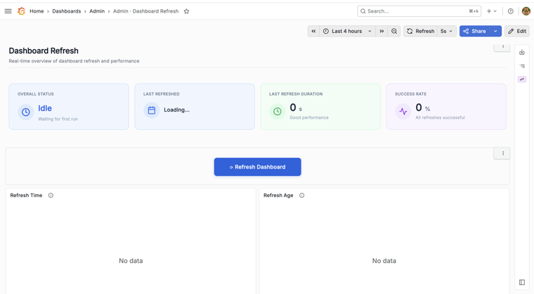
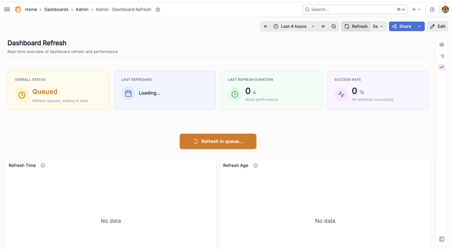
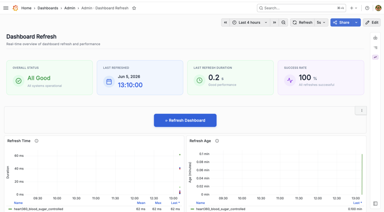
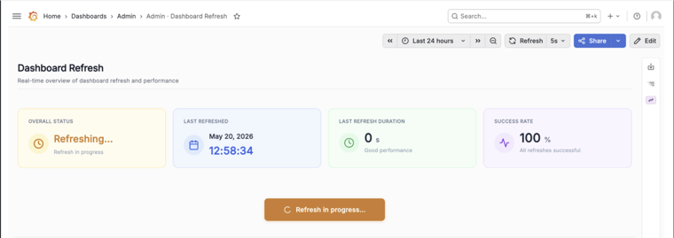
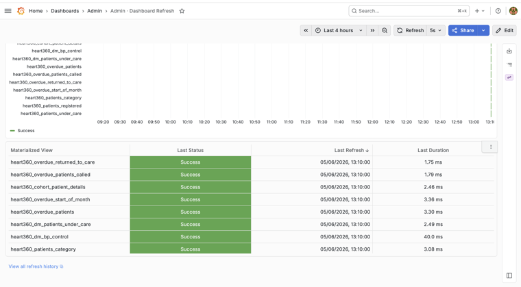
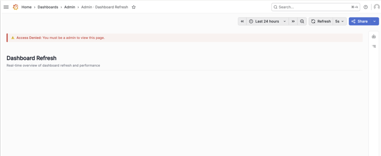
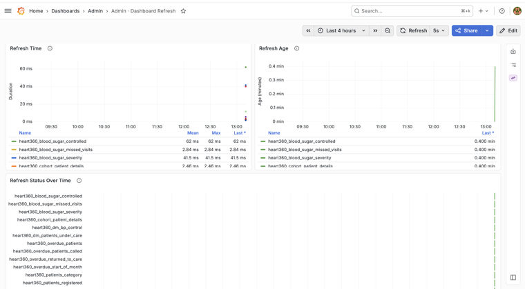

# Grafana Admin Dashboard Refresh – Visual Documentation

## Overview
This document captures the visual workflow and behavior of the new Grafana Admin Dashboard Refresh feature.

The dashboard provides admins with:
* Visibility into dashboard refresh freshness and status
* Manual refresh capability from Grafana
* Per-matview refresh monitoring
* Admin-only access control

---

## 1. Initial First-Time Admin State

### Purpose
This screen represents the initial state of the Grafana Admin Dashboard when an admin logs in for the first time before any dashboard refresh has been triggered.

### Expected Behavior
* Overall status displays as `Idle`
* Last refreshed section displays `Loading...`
* Last refresh duration displays `0s`
* Success rate displays `0%`
* Per-view refresh detail section shows `No data`
* **Refresh Dashboard** button is visible and enabled for admins
* This state confirms the system is initialized correctly and waiting for the first manual refresh

---

## 2. Refresh Queued / Refresh In Progress State

### Purpose
This screen demonstrates the refresh lifecycle immediately after clicking the **Refresh Dashboard** button.

### Expected Behavior
* Clicking the refresh button triggers a new refresh job
* Status changes from:
  * `Queued`
  * `Refreshing`
* Progress/loading state is visible
* User can monitor refresh activity in real time

---

## 3. Successful Refresh State

### Purpose
This screen confirms that the refresh completed successfully.

### Expected Behavior
* Overall status changes to **All Good**
* **Last Refreshed At** timestamp updates
* Refresh duration is recorded
* Per-matview logs show successful refresh entries

---

## 4. Duplicate Refresh Prevention

### Purpose
This screen validates that duplicate refresh requests are prevented while a refresh is already running.

### Expected Behavior
* Clicking **Refresh Dashboard** during an active refresh does not start another run
* Button remains disabled or ignored while refresh is in progress
* The disabled UI is not visible in the current screenshot. We will need to manually verify this behavior by going through the admin dashboard flow.

---

## 5. Per-Matview Refresh Log Table

### Purpose
This section demonstrates detailed refresh tracking for individual materialized views.

### Expected Behavior
* Displays matview names
* Shows refresh duration per matview
* Shows success/failure status
* Displays refresh timestamps
* Helps admins identify slow or failed refreshes

---

## 6. Non-Admin Access Denied

### Purpose
This screen validates that the dashboard is restricted to admin users only.

### Expected Behavior
* Non-admin users cannot access dashboard data
* **Access Denied** banner/message is displayed
* No sensitive refresh information is visible

---

## 8. Admin Dashboard Overview

### Purpose
This screen shows the overall admin dashboard refresh page available only to admin users.

### Expected Behavior
* Dashboard loads successfully for admin users
* Shows overall refresh status
* Shows last refreshed timestamp
* Shows refresh duration
* Displays per-matview refresh logs
* Displays **Refresh Dashboard** button

#### Dashboard Layout & Components
The following sections show the top-level status card, the charts component, and the final materialized views log details:

1. **Top-Level Status Indicators & Manual Control Button:**
   

2. **Historical Performance & Freshness Charts:**
   

3. **Detailed Materialized View Logs Table:**
   
